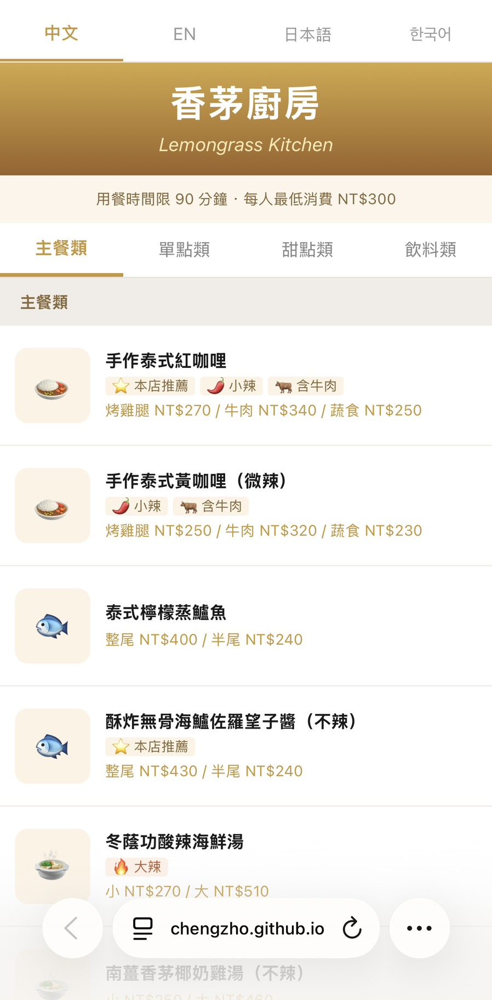
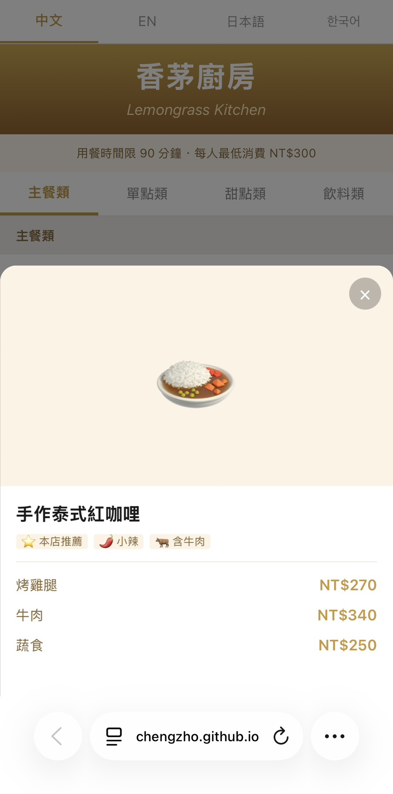

# 香茅廚房 Lemongrass Kitchen — 線上菜單

一個以 **手機瀏覽器** 為主的靜態餐廳菜單網站，支援 **繁體中文 / English / 日本語 / 한국어** 四語言切換，提供分類導覽、菜品標記 badge、品項詳情 Modal，以及 GitHub Pages 自動部署。

> 本專案以真實餐廳掃碼菜單情境為目標，重點放在 **可讀性、操作流暢度、多語言體驗**。

## Demo

- **GitHub Pages：** `https://chengzho.github.io/lemongrass-menu/`

---

## 專案特色

- **手機版優先設計**
  - 以 375px 寬度為核心設計
  - 適合餐廳桌邊掃碼瀏覽

- **四語言切換**
  - 支援繁體中文、英文、日文、韓文
  - 切換語言時不重新整理頁面

- **雙層 Sticky 導覽**
  - 語言切換列
  - 分類快捷列（主餐 / 單點 / 甜點 / 飲料）

- **菜單分類與資訊層級**
  - 依分類顯示菜色
  - 多規格價格（大 / 小、杯 / 壺、不同主食）清楚呈現

- **Tag Badge 系統**
  - 本店推薦
  - 辣度
  - 含豬 / 含牛 / 含羊
  - 素食
  - 清真認證

- **Item Detail Modal**
  - 點擊菜品可開啟詳情視窗
  - 顯示完整名稱、價格 / 規格、標記、備註與說明
  - 開啟時鎖定背景捲動，關閉後回到原本位置

- **圖片 / Emoji Fallback**
  - 若尚未提供菜品照片，會以 emoji 作為替代顯示

- **靜態部署**
  - 使用 GitHub Pages
  - 透過 GitHub Actions 自動部署

---

## Tech Stack

- **React 18**
- **TypeScript**
- **Vite 6**
- **Tailwind CSS v4**
- **GitHub Pages**
- **GitHub Actions**

---

## 專案畫面




---

## 本地開發

```bash
npm install       # 第一次需執行
npm run dev       # 啟動開發伺服器，開啟 http://localhost:5173/lemongrass-menu/
```

---

## 建置與預覽

```bash
npm run build     # 輸出正式部署檔案到 dist/
npm run preview   # 本地預覽 build 結果（http://localhost:4173/lemongrass-menu/）
```

---

## GitHub Pages 部署

本專案使用 GitHub Actions 自動部署到 GitHub Pages。

### 第一次設定（只需做一次）

1. 進入 GitHub Repository → **Settings**
2. 左側選單點選 **Pages**
3. 在**Source** 選擇 **GitHub Actions**
4. 儲存後，下次 push 到 `main` 就會自動部署

### 自動部署流程

- 每次 push 到 `main` 分支後，GitHub Actions 會自動執行：
  1. `npm ci` — 安裝套件
  2. `npm run build` — 建置靜態檔案
  3. 上傳 `dist/` 
  4. 部署至 GitHub Pages

- 可在 Repository → **Actions** 頁籤查看執行狀態
- 部署完成後網址為：`https://chengzho.github.io/lemongrass-menu/`

---

## 如何修改菜單資料

本專案的資料分為兩層：

- `src/data/menu-raw.ts`
  - 店家維護用
  - 全中文、方便手動編輯
- `src/data/menu-i18n.ts`
  - 前端實際讀取用
  - 含繁中 / 英文 / 日文 / 韓文完整資料

### 日常維護建議

> 若只是更新菜單內容則編輯 `src/data/menu-raw.ts`。  
> 若要更新翻譯，再同步編輯 `src/data/menu-i18n.ts`。

### 新增品項

在 `src/data/menu-raw.ts` 中複製一個現有區塊，修改內容：

```ts
{
  category: 'main',          // 'main' 主餐 | 'side' 單點 | 'dessert' 甜點 | 'drink' 飲料
  name: '新品項名稱',
  options: ['270'],          // 單一價格
  // options: ['大 510', '小 270'],       // 分大小
  // options: ['烤雞腿 270', '牛肉 340'], // 分主食
  // options: ['時價'],                   // 時價
  tags: ['R'],               // 標記代碼，無則填 []
  image: null,               // 圖片檔名或 null
  emoji: '🍛',               // 無圖片時的替代圖示
  note: '',                  // 中文備註，不需要填 ''
},
```

### 標記代碼對照表

| 代碼 | 圖示 | 中文 |
|------|------|------|
| `R` | ⭐ | 本店推薦 |
| `1` | 🌶️ | 小辣 |
| `2` | 🌶️🌶️ | 中辣 |
| `3` | 🔥 | 大辣 |
| `P` | 🐷 | 含豬肉 |
| `B` | 🐂 | 含牛肉 |
| `L` | 🐑 | 含羊肉 |
| `V` | 🥬 | 素食 |
| `H` | ☪️ | 清真認證 |

### 新增菜品照片

1. 將照片放入 `public/images/` 資料夾（建議 JPG，長寬比 1:1 或 4:3）
2. 在 `src/data/menu-raw.ts` 對應品項的 `image` 欄位填入檔名：
   ```ts
   image: 'red-curry.jpg',
   ```
3. 同步更新 `src/data/menu-i18n.ts` 中對應品項的 `image` 欄位
4. Push 到 `main` 就會自動重新部署

### 更新翻譯（menu-i18n.ts）

`src/data/menu-i18n.ts` 是前端實際讀取的四語言資料。  
新增品項時需同步在此檔加入對應的多語言物件，格式參考現有品項。

---

## 專案結構

```
src/
├── components/
│   ├── Header.tsx            # 店名 + 用餐資訊
│   ├── LanguageSwitcher.tsx  # 語言切換列（sticky）
│   ├── CategoryNav.tsx       # 分類快捷列（sticky）
│   ├── MenuSection.tsx       # 單一分類區塊
│   ├── MenuCard.tsx          # 品項卡片
│   ├── TagBadge.tsx          # 標記 badge
│   └── ItemDetailModal.tsx   # 品項詳情 Modal
├── data/
│   ├── menu-raw.ts           # 店家維護用（純中文）
│   ├── menu-i18n.ts          # 四語言完整資料（前端讀取）
│   ├── tags.ts               # 標記系統定義
│   └── site-info.ts          # 店名、規則等常量
├── hooks/
│   └── useLanguage.ts        # 語言狀態管理
├── types/
│   └── menu.ts               # TypeScript 型別定義
├── App.tsx
├── main.tsx
└── index.css
public/
└── images/                   # 菜品照片放這裡
```

---

## 設計與開發流程

本專案的設計與實作流程大致如下：

1. 根據手寫菜單與需求撰寫 menu-design-prompt.md
2. 使用 Pencil 產出 UI 設計稿（.pen）
3. 使用 Claude Code 依設計稿與 prompt 實作 React + Vite + TypeScript 專案
4. 透過 GitHub Actions 自動部署到 GitHub Pages

---

## 後續延伸方向

未來可進一步延伸的方向包括：

- 後台編輯介面（取代手動修改資料檔）
- 雲端圖片管理（如 S3）
- 多語內容半自動翻譯流程
- 使用分析（熱門菜色、常用語言）
- 正式商用部署（如 S3 + CloudFront）